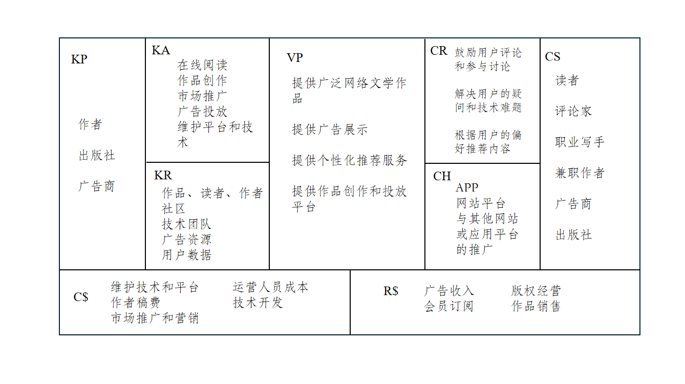

# Lab 2 商业模式评估

## 1 商业模式评估简介

### 1.1. 小组成员
| 姓名       | 学号      |
| ---------- | --------- |
| 王慕晨(PM) | 231250164 |
| 周旭       | 231250009 |
| 单煜翔     | 231250019 |
| 王彬宇     | 231250166 |
### 1.2. 工作概要
 
在上一阶段，我们针对“起点中文网”这一竞品进行了相关讨论。本阶段我们完成商业模式环境分析、总体评估、SWOT分析、蓝海战略等工作，并对商业模式画布进行更新

### 1.3. 度量数值

小组对于教材上列举的商业模式环境里每个方面的每个子问题都结合美图秀秀商业模式进行回答。
总体评估中的加分项为5项，减分项为5项，合计10项。
SWOT选择的是**价值主张**方向。
蓝海战略选择的是****方向。
整个评估作业中所引用的新闻和调研报告共计****篇。
本文除框架之外，主要内容字数为****字。

## 2 竞品商业模式画布

## 3 商业模式环境

### 3.1 市场影响力

#### 3.1.1 市场问题

##### 3.1.1.1 影响客户环境的关键问题有哪些？

对于起点中文网而言，它是一款兼具读书听书、内容创作和社交功能的应用，因此应该回答在读书听书的体验、内容创作和社交平台市场的关键问题：

- 在线文学行业会受到政府监管和政策变化的影响，例如内容审查、文学作品的审查等。对于网络文字传播的管控不断加强，图片审核、社交言论等方面推出更严格的监管举措。
- 网络文学行业的盗版问题一直比较严重，很多不法网站通过“盗帖”，“爬虫”等技术盗取，免费刊载热门文学，提高浏览量，吸引广告商。
- 网络的社交属性不断增强，人们通过图片、视频等多媒体进行社交的需求渐长。

##### 3.1.1.2 哪些改变正在发生？

对于起点中文网而言，该问题意指有哪些改变正在发生于读书听书的体验、内容创作和社交平台市场：

- 大环境下，国家反对垄断、推动市场良性竞争始终在路上。对于网络文字的管控不断加强，社交言论等方面推出更严格的监管举措
- 随着娱乐化阅读的盛行，读者对于小说的需求更加倾向于轻松、快节奏、易消化的内容。
- 人们越来越依赖个性化推荐算法来发现新的阅读内容，同时也更喜欢通过社交媒体分享阅读体验和与其他读者交流。
-  IP（知识产权）在文学作品中的应用越来越普遍，小说被改编成电视剧、电影、动漫等形式，形成跨媒体的延伸。

##### 3.1.1.3 市场将走向何处

对于起点中文网而言，该问题意指一个在线小说阅读平台的市场的主流可能会是什么：

- 随着智能手机和移动互联网的普及，移动阅读已成为主流趋势。平台应当提升移动端用户体验，吸引更多的移动用户。
- 未来，个性化推荐算法和社交化阅读功能可能会进一步发展和完善。
- 进一步加强与影视、动漫等产业的合作，开发更多优秀的IP作品，并实现跨媒体的延伸。
- 平台可以通过提供多语种的阅读服务、推广中国优秀的文学作品，在国际市场上拓展业务。

#### 3.1.2 市场分类

##### 3.1.2.1 哪些是重要的客户群体

对于起点中文网而言，该问题体现在起点中文网的重要客户群体组成是那些群体：

- 涵盖不同年龄段的网络文学爱好者，特别是对原创网络小说有着浓厚兴趣的读者。
- 包括年轻的创作者和有经验的老手的作者群体。
- 在社交平台通过分享获取流量收益的博主
- 希望通过广告在起点中文网平台上推广自己的品牌、产品或服务的广告商公司。
- 对优质的原创小说作品感兴趣，希望通过起点中文网平台发现和合作优秀的作者和作品的出版社。

##### 3.1.2.2 哪个群体的增长潜力最大？

对于起点中文网而言，该问题体现在起点中文网的重要客户群体中哪个群体的增长潜力最大：

- 年轻读者群体： 随着互联网的普及和移动阅读的流行，年轻一代对于网络文学的需求可能会持续增长。年轻读者群体通常对新鲜、多样化的内容更感兴趣，而起点中文网作为一个内容丰富的在线小说平台，可以吸引更多年轻读者的关注和使用。

##### 3.1.2.3 哪些群体的增长潜力在缩小？

对于起点中文网而言，该问题体现在起点中文网的重要客户群体中哪些群体的增长潜力在缩小：

- 年长读者群体： 年长读者群体可能在技术使用和接受新事物方面相对保守，可能对网络文学平台的接受程度较低。随着时间的推移，这一群体的规模可能会逐渐缩小。
- 单一内容偏好群体： 随着人们对内容需求的多样化，只针对特定类型或题材的内容偏好群体可能会面临一定的缩小。起点中文网需要不断扩大内容覆盖面，以满足不同读者群体的需求，吸引更广泛的用户群体

##### 3.1.2.4 哪些边缘群体值得留意？

对于起点中文网而言，该问题体现在起点中文网的客户群体中还有哪些边缘群体值得留意：

- 少数民族读者群体： 在中国，有许多少数民族群体，他们可能有自己独特的文化背景和阅读需求。尽管规模相对较小，但如果起点中文网能够针对少数民族读者群体提供相关内容，可能会吸引他们的关注和使用。
- 老年读者群体： 随着中国老龄化程度的加剧，老年读者群体也逐渐成为一个值得关注的市场。虽然他们可能对于新技术和网络阅读的接受程度相对较低，但如果起点中文网能够提供简单易用的操作界面和内容丰富的老年文学作品，可能会吸引更多老年读者的关注。
- 跨国移民群体： 随着全球化的进程，跨国移民群体在中国的规模也逐渐增加。这些移民可能会对自己国家的文学作品感兴趣，如果起点中文网能够提供多语种的阅读服务和多元文化的内容，可能会吸引更多跨国移民的关注和使用。

#### 3.1.3 需求和诉求

##### 3.1.3.1 客户需要什么？

对于起点中文网的客户，客户需要的主要包括以下几个方面：

- 提供丰富多样、高质量的小说内容，涵盖不同题材、类型和风格，以满足不同读者群体的阅读需求。
- 享受到流畅、便捷的阅读体验，包括网站或移动应用的界面友好易用、阅读页面清晰舒适等方面。
- 与其他读者进行交流、讨论，分享阅读体验和观点，建立良好的社交网络和阅读社区。
- 作者希望能够与读者进行互动，了解读者的反馈和意见，为自己的创作提供更多的灵感和动力；而读者也希望能够与作者进行直接的沟通和交流，了解作者的创作背景和故事。

##### 3.1.3.2 客户真正想要搞定什么？

对于起点中文网的客户，客户真正想要搞定的主要包括以下几个方面：

- 满足其阅读需求和兴趣。
- 提供舒适、愉快的阅读体验。
- 在阅读过程中感受到社交互动的乐趣和价值。
- 与喜爱的作者建立联系和互动。
- 获得与自己兴趣相关的个性化推荐，节省时间和精力，找到理想的阅读内容。

##### 3.1.3.3 没有被满足的客户需求里哪个最值得关注？

- 最值得关注的未被满足需求是个性化推荐服务。

##### 3.1.3.4 哪些需求在增加？

对于起点中文网而言，该问题体现在起点中文网的客户需求中哪些需求在增加：

- 个性化推荐服务： 随着社会信息爆炸和用户个性化需求的增加，个性化推荐服务的需求也在增加。用户希望平台能够利用大数据和人工智能等技术，根据其阅读历史、兴趣偏好以及社交互动行为，为其量身定制推荐内容，提升用户满意度和忠诚度。
- 移动阅读体验： 随着移动互联网的普及，用户对于在移动设备上进行阅读的需求逐渐增加。因此，用户对于在起点中文网上能够提供流畅、便捷的移动阅读体验的需求也在增加。
- 社交互动功能： 随着社交网络的兴起和社交化阅读的普及，用户希望能够在平台上与其他读者进行交流、讨论，分享阅读体验和观点，建立良好的社交网络和阅读社区的需求也在增加。

##### 3.1.3.5 哪些需求在减少？

对于起点中文网而言，该问题体现在起点中文网的客户需求中哪些需求在减少：

- 单一内容偏好需求： 随着用户阅读需求的多样化和个性化，对于单一类型或题材的内容偏好的需求可能会减少，用户更希望获得更丰富多样的阅读选择。

#### 3.1.4 切换成本

##### 3.1.4.1 哪些东西将客户捆绑在一家供应商和它的服务上？

对于起点中文网而言，该问题体现在起点中文网解决了哪些用户的核心需求并增强了用户粘性：

- 汇聚了大量优质的小说内容，涵盖了各种不同类型和题材的作品。
- 根据用户的阅读历史、兴趣偏好和行为习惯为其推荐适合的小说作品。
- 丰富的社交互动功能，包括评论、点赞、收藏、打赏等，用户可以与其他读者进行交流、分享阅读体验，甚至与作者进行互动。
- 提供了多端口支持，包括网站、手机应用等多种形式，用户可以随时随地通过不同的设备访问平台进行阅读。

##### 3.1.4.2 哪些切换成本组织客户转投竞争对手？

- 相当甚至更好质量的小说内容，并且拥有更广泛的内容覆盖范围。
- 个性化推荐算法更准确、更智能，能够更好地理解用户的阅读喜好和兴趣，为其提供更贴合口味的推荐内容。
- 社交互动功能更丰富、更有趣，能够提供更好的社交体验和更多的交流机会。
- 更具竞争力的价格和更灵活的付费模式，如更低的订阅费用、更多的免费内容或更多的付费选项。
- 平台体验和用户界面更友好、更流畅，能够提供更好的阅读体验和更便捷的操作方式。

##### 3.1.4.3 客户容易找到并采购类似的服务吗？

起点中文网的服务主要包含读书听书、内容创作等。事实上，当下的市场中存在大量类似的产品，客户很容易找到并采购类似的服务，例如番茄小说、菠萝包轻小说等。

##### 3.1.4.4 品牌有多重要？

在起点中文网所在的领域，品牌至关重要。网络文学平台属于文化娱乐领域，用户对于内容的选择往往受到品牌的影响。

- 一个良好的品牌能够赢得用户的信任和忠诚度。
- 有利于广告商广告业务的投入
- 能够吸引更多的用户和作者，获取更多的流量和内容资源，从而实现规模化发展和持续增长。
- 更容易吸引新用户并留住现有用户，增加用户的注册和试用率。

#### 3.1.5 收入吸引力

##### 3.1.5.1 客户真正愿意花钱买的是什么？

对于起点中文网的用户来说，客户真正愿意花钱购买的主要是以下几个方面的价值：

- 大量的付费小说内容，包括独家作品、VIP作品等。
- VIP会员享有诸多特权和服务，例如提前阅读新章节、免费领取VIP作品、专属客服服务等。
- 高级用户体验和功能，例如去广告阅读、离线阅读、自动订阅更新等。
- 精品付费服务和活动，例如线上作家见面会、签名小说预售、限量版纪念品等。
  
##### 3.1.5.2 利润中最大的一块从哪里获得？

在我们的商业模式画布中，收入来源包括广告收入、会员订阅、作品销售，ip联动等。从美图公司的报告上看，利润最大的一块主要来自付费会员收入。

##### 3.1.5.3 客户能够轻易地找到并购买更便宜的产品和服务吗？

起点中文网的VIP订阅费用为连续包月为一个月10元，属于正常互联网产品VIP服务定价，并且会不断有福利和代金券的发放。对客户而言，找到更便宜的同类型且同等质量的产品其实是不容易。

### 3.2 行业影响力

#### 3.2.1 （现有的）竞争对手
  
##### 3.2.1.1 哪些是我们领域的主导者和竞争对手？

- 番茄小说
- 17k小说网

##### 3.2.1.2 竞争者的竞争优势和劣势分别是什么？

- 优势：番茄小说题材海纳百川，现在还能看到第一人称社会文，而且和脑洞文同处一个榜单，就是赛高！17k小说网稳健，大平台大背景，一些参评和报名机会比较多，不会拖欠稿费，渠道比较多。
- 劣势：番茄小说题材海纳百川，现在还能看到第一人称社会文，而且和脑洞文同处一个榜单，就是赛高！17k小说网要做好本站一直单机的准备，流量比较低迷，而且之前是版权转让合同，新的不确定改了没，要注意辨识。

##### 3.2.1.3 竞争者有哪些产品和服务？它们聚焦于哪些客户群体？成本结构如何？

它们提供的产品和服务与起点中文网类似，因而而聚焦客户群体也较为相似，但也有一些区别：
- 番茄小说更吸引年轻一代读者，因为它可能提供更多与时尚、校园、都市生活相关的作品。
- 17k小说吸引更广泛的年龄段，因为它提供了多样化的作品类型和题材。

对于成本结构而言，它们都是已经商业化的应用，其成本结构主要包含内容采购成本、平台运营费用、版权费用和营销推广费用。

##### 3.2.1.4 竞争者对我们的客户群体、收益来源和利润有什么影响？

番茄小说对起点中文网的影响：
  
- 番茄小说会吸引年轻一代读者和特定偏好的读者群体，如偏爱轻松、搞笑、校园题材的年轻读者。
- 通过提供更具吸引力的VIP会员服务、优惠活动等方式吸引用户，影响起点中文网的会员收入。
  
17k小说对起点中文网的影响：

- 覆盖更广泛的读者群体，包括不同年龄段和兴趣爱好的读者。这可能会导致起点中文网的一部分用户流失或分流至17k小说，尤其是对于喜欢多样化作品类型的读者。
- 通过更多样化的付费章节和作品、更具吸引力的VIP会员服务等方式吸引用户，影响起点中文网的会员收入和付费章节收入。

#### 3.2.2 新进入者（挑战者）

##### 3.2.2.1 谁是市场的新进入者？它们之间有什么不同？它们的成本结构与价值主张如何？聚焦哪些客户群体？

该问题意指有哪些网文阅读平台是该市场的新进入者，它们和老牌软件之间在针对的客户群体、价值主张、成本结构上有什么不同。

菠萝包轻小说是市场的新进入者

- 内容类型上，菠萝包轻小说更专注于轻小说类型，即轻松、幽默、日常生活为主题的小说，通常以轻快的风格和简洁的文笔为特点，更加贴近年轻读者的口味。
- 成本结构上，菠萝包轻小说虽然已经积累了相当的用户基础，但还处于发展相对早期的环节，除了在开发费用、人力成本上投入更多之外，与更早进入者的成本结构基本一致。
- 客户群体上，菠萝包轻小说的内容风格和主题更贴近年轻人的口味和兴趣，因此主要聚焦于年轻读者群体，包括学生、青少年和年轻成年人。

##### 3.2.2.2 新进入者有哪些优势和劣势？

- 优势：菠萝包轻小说以轻松、幽默、简洁的文风和情节为特点，适合读者在闲暇时放松心情、放飞想象。汇集了大量的轻小说作品，涵盖了各种不同题材和风格，满足了读者不同的阅读需求。
- 劣势： 由于内容的自由发布性质，平台上的作品质量可能参差不齐，有些作品缺乏专业性和深度，影响了整体阅读体验。相对于像起点中文网这样的知名平台，菠萝包轻小说的知名度和品牌认知度可能较低，需要更多的市场推广和品牌建设工作。

##### 3.2.2.3 新进入者必须要克服哪些障碍？

- 使用更早进入者的用户转而使用新进入者的切换成本
- 提高目标客户和投资方对自身的关注度
- 版权市场的竞争和争夺

##### 3.2.2.4 新进入者对我们的客户群体、收入来源和利润有什么影响？

在该领域下，此问题意指新进入者对我们的客户群体、收入来源和利润有什么影响。

由于新进入者与更早进入者面向的客户群体不可避免地存在重合，因此会导致客户群体流失、收入来源占比改变，主要是会员费方面的利润减少

#### 3.2.3 替代产品和服务

##### 3.2.3.1 哪些产品和服务能够替代我们的产品和服务？

替代起点中文网的产品和服务可能包括以下几种类型：

- 其他网络文学平台
- 阅读类应用程序
- 自媒体平台
- 传统出版渠道

##### 3.2.3.2 它们的成本与我们的相差多少？

- 其他网络文学平台的成本与起点中文网相差不大。
- 阅读类应用程序的内容采购成本较低，但技术投入可能相对较高。
- 自媒体平台的内容采购成本较低，因为它们主要依靠作者自主创作，不需要支付大量的稿费或者购买版权费用。
- 传统出版渠道的内容采购成本较高，因为它们主要通过购买版权的方式获取优质的小说作品，支付的版权费用较高， 技术投入较低，因为传统出版渠道主要以纸质书籍形式出版，不需要大量的技术支持和投入。

##### 3.2.3.3 客户要切换到这些替代品有多容易？

- 切换到其他网络文学平台相对容易。用户只需要在新平台上注册账号，即可开始阅读作品。大多数网络文学平台提供免费注册，用户可以通过简单的操作即可访问平台上的内容。
- 切换到阅读类应用程序相对容易。用户只需在应用商店下载安装相应的应用程序，然后注册账号即可开始阅读。大多数应用程序提供简单直观的界面和操作，用户可以快速上手。
- 切换到自媒体平台相对较容易。用户只需要关注相关的公众号或在平台上搜索感兴趣的内容，即可开始阅读。自媒体平台通常提供了免费的内容，用户可以直接访问。
- 切换到传统出版渠道相对较不容易。用户需要前往书店购买纸质书籍，或者通过在线书店购买并等待邮寄，这需要一定的时间和物理努力。

##### 3.2.3.4 这些替代产品起源于何种商业模式传统？

- 其他网络文学平台和阅读类应用程序采用多变平台商业模式以及长尾商业模式，将读者和作者两个独立的群体相互依存，并且由个性化推荐使得小众书籍可以被大多数人阅读。
-  传统出版渠道的起源可以追溯到纸质书籍出版和实体书店销售模式。传统的出版渠道通过印刷、发行和销售纸质书籍获取收入，而实体书店则提供了图书展示、销售和阅读体验的场所。

#### 3.2.4 供应商和价值链上的其他厂商

##### 3.2.4.1 谁是你的行业价值链中的关键玩家？

在该领域下，此问题意指谁为起点中文网提供了所需要的关键服务：

- 作者
- 版权方
- 付费用户

##### 3.2.4.2 你的商业模式在多大程度上依赖这些关键玩家？

- 对于作者而言，作者是起点中文网最重要的内容提供者。他们创作原创小说作品，为平台提供丰富的内容资源。因此，平台的内容质量和多样性直接取决于作者的贡献。
- 对于版权方而言，起点中文网可以与版权方合作，购买优质作品的版权，以丰富平台内容。这些优质作品可以是独家版权或热门作品，吸引更多的读者和付费用户。
- 对于付费用户而言，付费用户是起点中文网的重要收入来源之一。他们购买VIP会员或付费章节，为平台带来直接的付费阅读收入。

##### 3.2.4.3 有边缘玩家在涌现吗？谁的利润最高？

在该领域下，此问题意指主要服务的提供者所在领域中是否有边缘参与者出现并产生较大影响，哪个主要服务的提供者从中获取的利润最高：

-  随着互联网的普及和数字化技术的发展，个人创作者和小型平台可以更容易地通过网络进行内容创作和发布。这使得自媒体作者和其他网络文学平台能够以更低的成本和更高的灵活性进入市场，与传统的文学出版和传播方式相比，更具竞争力。

#### 3.2.5 利益相关者

##### 3.2.5.1 哪些利益相关者会影响你的商业模式？他们的影响力如何？

- 阅文是上市公司，股东尤其是持股较多的大股东对公司决策的影响较大，它们的投资与撤资也会对公司的商业模式和进一步发展产生影响，因此影响力较大
- 员工在阅文公司内部参与公司决策的制定，但最终的决策权在公司领导人和股东手中，因此有一定的影响力
- 政府出台的政策会很大程度上影响公司决策的制定，并直接对公司的运作产生影响，因此影响力很大
- 用户能向公司反馈意见，在自己的圈子内种草或者拔草，并且囿于用户的意见并不一定可行等其他原因，聆听的一方并不一定会接受用户的意见，因此影响力有限
- 竞争者也会影响我们的商业模式。假如竞争者采取了某种新的模式并大获成功，就会使得我们反思自己的商业模式，进而改变自己的商业模式，因此有一定影响力

### 3.3 关键趋势

#### 3.3.1 技术趋势

##### 3.3.1.1 你的市场内外的主要技术趋势有哪些？

- 利用人工智能和大数据技术来优化内容推荐、个性化推荐、用户行为分析等功能，以提升用户体验和内容精准度。
- 采用云计算和边缘计算技术来提高系统的稳定性和扩展性。
- 区块链技术可以帮助确保内容的版权和真实性，以及构建更加公平、透明的内容分配机制。
- 内容生成算法和自动化创作技术，帮助作者提高创作效率和内容质量。

##### 3.3.1.2 哪些技术代表了重要的机会或者颠覆性的威胁？

自动化创作和内容生成技术可以帮助作者提高创作效率和内容质量，从而丰富平台的内容库。但是，如果自动化创作技术的应用程度过高，可能会减少人工创作的需求，导致创作者群体的不满和流失。

##### 3.3.1.3 哪些新兴技术是边缘客户正在逐步采用？

由3.1.2.4论述，边缘群体大多由老年群体、少数民族群体和国外群体构成，因而边缘客户可能会使用语音助手和智能音箱来获取和阅读网络小说，这些技术可以提供更便捷的交互方式。

#### 3.3.2 行业管理趋势

##### 3.3.2.1 哪些规则会影响你的市场？

- 国家对于技术使用的规定和管理。
- 国家对行业相关法律法规的立法完善，例如个人信息保护法、知识产权法等。
- 国家鼓励市场良性竞争，反对垄断。
- 国家对于网络言行等方面的管控力度不断加强。

##### 3.3.2.2 哪些规则会影响你的商业模式？

- 行业相关法律法规，例如对文字版权的规定会对成本结构，核心资源和收入来源产生直接影响。
- 国家反对垄断、推动市场良性竞争，这会影响重要合作，收入来源和价值主张。

##### 3.3.2.3 哪些管理规定和税费会影响客户需求？

- 版权保护和内容审查规定，如果管理规定对于版权保护和内容审查要求较为严格，可能会增加平台的审核成本和时间，限制内容的发布速度和数量，从而影响用户的内容选择和满意度。
- 内容审查和敏感内容处理，如果管理规定对于敏感内容（如色情、暴力、政治敏感等）的审查要求较为严格，可能会限制平台上的内容种类和数量，影响用户的阅读选择和偏好。
- 税费和费用增加，如果税费和费用增加，可能会导致平台提高服务费用或者减少优惠活动，从而增加用户的使用成本，影响用户的消费意愿和付费能力。
- 广告限制和推广管制，如果管理规定对于广告的限制和推广的管制较为严格，可能会限制平台的营销活动和推广渠道，影响用户的获取渠道和平台知名度。

#### 3.3.3 社会和文化趋势

##### 3.3.3.1 社会的关键趋势是什么？

- 社会变得更加开放包容，社会走向全球化、多元化，个体走向多样化、个性化
- 开源、共享、互联网思维的兴起
- 人们美好生活需要不断增加，追求精神上的富足
- 社会群体活动的需求增加，消费欲望增加

##### 3.3.3.2 文化或社会价值观上的哪些变化会影响你的商业模式？

- 社交化阅读已经成为一种趋势，人们希望能够在阅读过程中与其他读者进行互动和分享。起点中文网可以加强社交功能的建设，鼓励用户参与评论、点赞、分享等活动，提升用户的社交体验和参与感。
- 随着社会的多元化发展，人们对于多元化文化表达的追求也在增加。用户希望能够在阅读中接触到不同文化背景、不同价值观的作品，丰富自己的阅读体验。起点中文网可以加大对多元文学作品的推广力度，吸引更多不同文化背景的读者。  

##### 3.3.3.3 哪些趋势会影响购买者的行为？

- 随着知识付费意识的提升，人们对于优质内容的付费意愿也在增加。起点中文网可以加强付费内容和增值服务的开发，提供更多高质量、独家内容，吸引用户付费阅读。
- 购买者越来越倾向于通过在线评论和用户口碑获取产品信息和购买建议，他们更愿意相信其他消费者的评价和经验。因此，企业需要加强对用户评论和反馈的管理，提升产品质量和服务水平，赢得用户口碑。

#### 3.3.4 社会经济趋势

##### 3.3.4.1 关键人口统计学趋势有哪些？

出生人口降低，人口老龄化严重，人口结构发生变化，这会影响到用户群体的构成.

##### 3.3.4.2 市场中收入和财富的分布有哪些特征？

- 网文平台的用户群体非常广泛，涵盖了各个年龄段、职业和收入水平的用户。从低收入的学生、工薪阶层到高收入的白领、专业人士，都有可能成为网文平台的用户。
- 中等消费者人数最多，其次为中高消费者和中低消费者

##### 3.3.4.3 所处市场的消费特征是什么？

追求品味消费和品质消费。市场中的用户崇尚品牌态度，更愿意为好品质付费.

##### 3.3.4.4 城镇人口相对于农村人口的比例如何？

据调查显示，居住在一二线城市的用户占比较高。而目前城镇人口相对于农村人口的比例增加，城镇化进程加快，这会影响到用户群体的构成。

### 3.4 宏观经济影响

#### 3.4.1 全球市场情况

##### 3.4.1.1 经济是否处于爆发期？总体市场情绪如何？

全球经济未处在爆发期，反而处在一个艰难时期。有过去三年新冠疫情对人类健康造成的冲击，以及由此带来对经济的负面影响，也有全球地缘政治危机，使得全球业已存在的能源危机和粮食危机更加严重。这些问题在2023年仍将继续存在。据国际货币基金组织去年10月最新预测，去年全球经济增速为3.0%，较前年下降0.5个百分点，更是低于过去20年3.8%的平均水平，今年增速将进一步降至2.9%。当前，全球通胀水平整体回落，消费和服务业表现较为强劲，世界经济得以延续复苏态势。

##### 3.4.1.2 GDP增长率如何？

据报道显示，2023年我国GDP增长率为5.2%

##### 3.4.1.3 失业率有多高？

据报道显示，2024年第一季度失业率为5.2%

#### 3.4.2 资本市场

##### 3.4.2.1 资本市场处于什么状态？

受到疫情、地缘政治风险升级、去全球化和支付体系碎片化的影响，资本市场在2023年上半年逐渐呈紧缩状态，全球经济放缓。中国正面临潜在的经济放缓，消费需求疲软，房地产市场不景气。但是资本市场对于生成式AI等新技术十分关注。

##### 3.4.2.2 所处市场中获得投资有多容易？现在就能获得种子资本、创业资本、 众筹、市场资本或者贷款吗？获得这些投资的成本有多高？

在网文平台上获得投资相对容易

- 字节跳动全资子公司北京量子跃动科技有限公司，入股广州萌萌达网络科技有限公司，后者旗下拥有原创文学网站九库文学网。这已经是字节跳动在网文领域的第5次出手。此前，字节曾接连投资吾里文化、秀闻科技、鼎甜文化、塔读文学等平台。
- 2021年，3月4日，免费网文阅读平台米读小说也宣布获得1.1亿美元的C轮融资。

#### 3.4.3 大宗商品和其他资源

##### 3.4.3.1 业务必备的大宗商品和其他资源的当前市场状态如何？

起点中文网作为中国最大的网络文学平台之一，拥有丰富的资源和优势，但在当前市场状态下，这些资源的价值和利用情况可能会受到多种因素的影响:

- 起点中文网拥有大量的优质原创作品和作者资源，这是其最重要的资产之一。然而，随着网络文学市场的竞争加剧和读者口味的不断变化，起点中文网需要不断更新和优化内容库，推出符合市场需求的新作品，以保持竞争力和吸引力。
- 起点中文网拥有庞大的用户群体，包括注册用户和活跃用户。这些用户是平台的生命线，对于平台的流量、活跃度和盈利能力至关重要。然而，随着市场竞争的加剧和用户需求的多样化，起点中文网需要不断提升用户体验，增加用户粘性，留住现有用户，并吸引更多新用户的加入。
- 起点中文网拥有众多优秀的IP作品，如《择天记》、《圣墟》等，这些IP作品在文学领域具有较高的影响力和商业价值。平台可以通过IP开发、衍生品开发等方式实现多元化盈利，但需要注意保护知识产权，防止侵权和盗版行为。
-  起点中文网作为中国网络文学领域的领军企业之一，拥有较高的品牌知名度和良好的市场声誉。这为平台吸引用户、作者和投资者提供了有利条件，但也需要平台保持品牌形象，避免出现负面事件对声誉造成影响。

##### 3.4.3.2 执行商业模式所需资源有多么容易获取？成本如何？价格走向如何？

主要成本中的前期成本，运营成本，和营销成本都相对稳定。运营成本中的服务器以及数据库成本都持续走低而且稳定。营销成本主要是广告上的开支，随着互联网寒冬的到来，广告成本也持续走低。

#### 3.4.4 经济基础设施

##### 3.4.4.1 所处市场的公共基础设施有多优良？

我国IT行业基础设施提供商众多，市场规模巨大。行业处于快速扩张阶段，能够提供多种高质量服务。

##### 3.4.4.2 你如何评价交通、贸易、学校质量，以及连接供应商和客户的便利度？

- 我们认为交通这一因素与起点中文网的商业模式关系不大，因此不予考虑。

- 我国高校在人工智能领域以及AI创作技术领域实力强劲 ,能够为起点中文网提供人才支持。

- 起点中文网的产品主要采取电商的方式进行交易，能够打破时间和空间的局限。起点中文网提供一个平台将供应商和客户连接起来，这样的交易方式十分便利。起点中文网平台上提供的产品来源广泛，数量众多，因此贸易质量良莠不齐。

##### 3.4.4.3 个人和企业的税费有多高？

居民企业的所得税为25%，小微企业所得税为20%，国家需要重点扶持的高新技术企业所得税为15%。

##### 3.4.4.4 对商业组织的公共服务有多好？

- 国家开展清朗行动，打击假冒APP，小程序等，清理虚假信息，保障互联网企业权利。

- 我国互联网领域法治不断健全、监管不断完善，这为互联网企业加强管理、规范运营提供了有力保障。相关部门通过加强惠企政策统筹协调等方式，为广大互联网企业健康持续发展提供有力保障。

##### 3.4.4.5 你如何评价这里的生活质量？

- 我国居民生活质量相较十年前有较大提升，发展型享受型消费日益提升。

- 我国城乡基础设施建设不断完善，居住条件得到改善。

- 配套医疗服务和教育服务水平提高。我国居民生活质量相较十年前有较大提升，发展型享受型消费日益提升。
 
## 4 评估商业模式环境

### 4.1 总体评估

#### 4.1.1 加分项

##### 4.1.1.1 评估优势

- 起点中文网的价值主张良好匹配了客户的需求。平台中质量较高的小说满足了读者对付费阅读模式的需求。
- 我们的价值主张有很强烈的网络效应。平台中的社区有一定舆论影响力，并且起点具有一些深受人们喜爱的IP版权。
- 我们的产品和服务是强耦合的，读者在订阅会员后，可以享受到更好的服务。

##### 4.1.1.2 评估威胁

- 在同类付费网文平台中，起点在版权维护、内容创作、品牌影响力等多方面均为行业前列，竞争对手难以在相同价格下提供更有价值的内容和体验。

##### 4.1.1.3 评估机会

- 作者能够通过把产品转化为服务而产生重复性收入。作者写出的小说和IP能够在起点的书架、周边货架上长期被其他客户所浏览，并为创作者不断提供收益。
- 内容已整合到更多的平台和渠道上，包括移动应用、社交媒体、电子书阅读器等，提升用户的便利性和可访问性。

##### 4.1.1.2 

#### 4.1.2 减分项

##### 4.1.2.1 评估劣势

- 起点中文网会遭到客户的投诉。针对盗版版权、内容封杀等问题，被一些读者和作者所诟病。

##### 4.1.2.2 评估威胁

- 网络文学领域竞争激烈，出现了许多新兴的竞争对手，如番茄小说、17k小说等，威胁到起点中文网的用户流失和市场份额。
- 起点中文网的优秀作品和IP可能面临侵权、盗版等风险。
- 随着社会发展和用户群体结构的变化，用户对网络文学平台的需求也在不断变化。

##### 4.1.2.3 评估机会

- 目前尚未引入人工智能等技术手段，优化AI内容创作和个性化服务，提升平台的智能化水平和竞争力。
- 尚未在起点中文网基础上构建完整的内容生态系统，包括原创作品、衍生品、影视化、游戏化等多种形式，实现内容的多元化延伸和商业化利用。
- 尚未面向海外市场进行国际化拓展，推广平台的优质内容和品牌形象。

#### 4.1.3 创意核心

随着其他大厂入场数字阅读行业和免费阅读的冲击，起点读书的市场份额被不断挤压，如何应对掌握入口优势的大厂竞争以及免费化趋势是决定起点读书未来的关键，而这核心在于如何更好地践行起点的**价值主张**。    
面对其他同类产品的竞争，起点读书要稳扎稳打，维持好自己的社区优势和优秀作家团队优势。免费化趋势实质是用户消费习惯分化及个性化的产物，这种分化不仅出现在不同地域、不同阶层的人群上，甚至可以出现在同一个人身上，用户的消费决策不仅取决于他们的总预算，也取决于他们内心赋予各项开支的优先度。起点读书要积极满足用户的消费习惯，既要在一定程度上顺应免费化趋势，如持续降低用户消费压力，又要持续提高平台内小说质量，如鼓励作家们创作出更多满足大众口味的作品。

## 5 蓝海战略

## 6 更新后的商业模式画布

## 引用资料来源