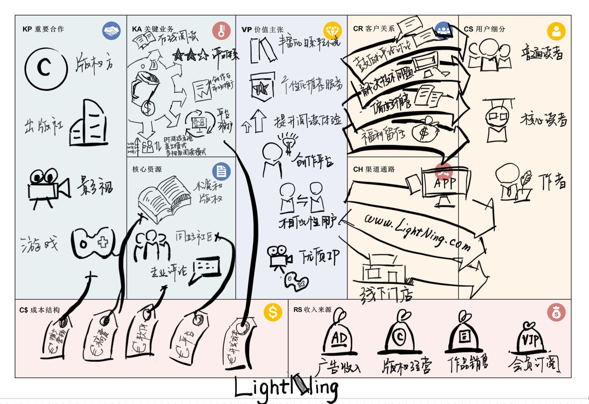

## Lab3 商业模式设计

### 目录

### 1 商业模式设计简介

#### 1.1 组员信息

|    姓名    |    学号    |
| :--------: | :--------: |
| 王慕晨(PM) | 231250164  |
|    周旭    | 2331250009 |
|   单煜翔   | 231250019  |
|   王彬宇   | 231250166  |

#### 1.2 工作概要

#### 1.3 度量数值

### 2 客户洞察

#### 2.1 轻小说作家

此类用户主要是在平台上创作轻小说的群体，通常是动漫和轻小说领域的爱好者

##### 2.1.1 统计特征

轻小说作家主要集中在20-35岁之间，主要集中在大中城市，尤其是文化产业发达的地区如北京、上海、东京等地。这些城市提供了丰富的创作资源和机会，同时也拥有庞大的读者基础。在职业状态方面，轻小说作家分为全职和兼职两类。一部分作家以写作为职业，他们全身心投入到故事创作中，另一些则是兼职作家，通常有其他稳定的工作。轻小说作家的创作风格多样，从冒险、幻想、科幻到校园、恋爱等题材，各有千秋。他们擅长构建复杂的世界观和精巧的情节设计，使作品充满吸引力。

##### 2.1.2 移情图

随着当今信息的海量化与碎片化，想要吸引读者，留下广受好评的轻小说成为了不小的挑战。许多轻小说作者苦于自己辛苦写出的日系轻小说关注度不高，没有流量，自己却背负着生活和写稿的压力。LightNing平台更专注于日系轻小说，鼓励作者创作多线程模式的作品并给予优厚稿费，评分系统特别且对读者评分设定了门槛，对高评分的作品会给予推广和稿费的支持，有许多与其他公司的合作，还有特别的读者社区，作家看到了一个能为他们提供优质环境的平台。

#### 2.2 轻小说普通读者

##### 2.2.1 统计特征

普通读者阅读频率较低，偶尔阅读轻小说，通常每月阅读一两本，阅读范围一部分在轻小说，但也会阅读其他类型的小说和漫画。倾向于选择热门或推荐的轻小说，不太会深入挖掘冷门作品。

##### 2.2.2 移情图

在当今碎片化的时代，大量轻小说作品被创作出来，质量参差不齐，读者面对海量的推送和奇怪的评分机制导致自己很难选到喜欢的作品，读者希望看到高质量、经过精心策划和创作的作品变得越来越难。读者看到喜欢的作品后，希望有更多的交流和互动平台，但缺乏这样的资源和机会。 LightNing有全面的轻小说生态系统，集轻小说阅读、评分、社区交流一体化，评分机制特殊且对读者评分设定了门槛，对推送机制做出了优化，这让即使阅读轻小说数量不多的读者也能找到自己喜欢的日系作品。

#### 2.3 轻小说资深爱好者

##### 2.3.1 统计特征

资深爱好者阅读频率较高，通常每周阅读多本轻小说。阅读范围：主要集中在轻小说，并且会扩展到相关的漫画、动画等。倾向于选择特定作者、系列或出版社的轻小说，对新作和连载作品保持高度关注。

##### 2.3.2 移情图

对于轻小说资深爱好者，他们期望看到高质量、深度的作品，具有独特的故事情节和创意，能够挑战他们的思维和情感。资深爱好者喜欢会忆自己读过的有趣的小说，回忆自己在不同时间体会过的独特感受。轻小说资深爱好者喜欢与作者和其他读者互动，分享读后感、讨论情节，建立社区氛围。但是很多社区氛围糟糕，读者与作者互动感低。 爱好者希望能够有更深度和细致的阅读体验，包括专门的讨论区、阅读笔记等功能，让他们更加沉浸于作品中。 LightNing有独特的开创多线并行模式小说，这让资深爱好者能在一个故事中体会不同的视角，收获别样的体验。LightNing创建了时间线机制，更好地帮助读者去记录梳理自己一路的阅读体验。LightNing有独特的阅读社，爱好者可以在里面讨论，交流，还可以获得购书的优惠的奖励

### 3 构思

#### 3.1 创新点构思

##### 3.1.1 融合一个创新的评分体系

根据**阅读速度、阅读时长、读书数量、阅读完本率、长评获赞/评数量**划分出一部分拥有评分权限的用户，并在有评分权限的用户的基础上随各元素增长逐渐由权重1提升至3（此处数字仅为举例），由评分来为读者阅读提供一部分参考。

###### 3.1.1.1 驱动因素

客户驱动

###### 3.1.1.2 如果……会怎样

*如果我们创新的评分体系*，那么LightNing会通过一些特殊的评分机制去减少刷分和一些不成熟的评分，让评分变得流行但有一定门槛，让读者更容易看到高质量、有深度的作品。这样一个创新的评分体系，有利于建立平台文化，创建更完整的社交平台生态，给用户更好更别致的体验。

###### 3.1.1.3 对商业模式画布的影响

该创意会对商业模式画布产生如下影响：

1.关键活动中加入创新的评分体系和根据评分相似性推荐用户

2.价值主张中增加创新评分体系。

##### 3.1.2 专注于日系轻小说

聚焦日系风格轻小说，而非其他平台上更偏简中网文圈的、更偏向玄幻、仙侠方向的风格。主要接受日系轻小说而非国式轻小说/国内网文的投稿，在审稿方面进行取舍。

###### 3.1.2.1 驱动因素

供给驱动

###### 3.1.2.2 如果……会怎样

*如果我们专注于日系轻小说*，那么LightNing将提供一种独特且差异化的阅读体验，更专注于日本轻小说这一特定细分市场。日系轻小说以其独特的叙事风格、深厚的文化背景以及鲜明的人物刻画吸引了大量读者。相比之下，国内网文市场更多集中于玄幻、仙侠等类型，而日系轻小说则在角色发展、情感描写和剧情复杂性上有不同的特点。通过精准定位，公司可以更有效地满足特定群体的需求，增强用户粘性和忠诚度。

###### 3.1.2.3 对商业模式画布的影响

该创意会对商业模式画布产生如下影响：

1.客户细分中增加核心读者群（日系轻小说）

2.价值主张中提升阅读体验

##### 3.1.3 搭建与版权方的渠道，成为出版商的合作平台

争取获得知名优秀轻小说汉化与代售权，增加平台知名度；同时可通过出版方出售我方平台优秀作品，增加平台原创作品的知名度与销量。

###### 3.1.3.1 驱动因素

资源驱动

###### 3.1.3.2 如果……会怎样

*如果我们 搭建与版权方的渠道，成为出版商的合作平台*，那么通过这一措施，LightNing将提升公司在读者心中的地位。通过获得知名轻小说的汉化与代售权，公司能够提供一系列高质量、有影响力的作品。通过与版权方和出版商的合作，公司可以利用对方已有的分销网络，将平台的知名度和影响力扩展到更广泛的市场。

###### 3.1.3.3 对商业模式画布的影响

该创意会对商业模式画布产生如下影响：

1.关键活动中去除版权维护，增加搭建与版权方的渠道，成为出版商的合作平台。

2.收入来源中公司可以通过版权销售和衍生产品（如动画、漫画、游戏等）的开发获得额外收入，即提高版权经营的权重。

3.关键资源中增加独家版权

4.关键合作中提高与出版社以及作者的联系与交流

##### 3.1.4 利用VR、AR等设备进一步提升阅读体验

在故事进入高潮情节时，若作者与平台的视觉效果团队达成共识，可以在这里结合VR、AR等设备提供场景、语音、背景乐等效果，视听结合，让读者获得更好的感受。

###### 3.1.4.1 驱动因素

客户驱动

###### 3.1.4.2 如果……会怎样

*如果我们去尝试这种技术*，那么会提升阅读体验的沉浸感。通过在故事高潮情节时结合VR和AR设备，提供逼真的场景、语音、背景音乐等效果。但是开发成本过高，且在价值主张方面提升不明显。

###### 3.1.4.3 对商业模式画布的影响

该创意会对商业模式画布产生如下影响：

1.价值主张中增加提升阅读体验

2.成本结构中的成本投入增加

##### 3.1.5 开创多线并行模式

很多读者在阅读时都会想：这个故事在书中另一位角色看来是怎样的，他们的心理活动是怎样的，他们对故事的态度是怎样的；同时，有很多优秀的轻小说也都采用了视角变换的写作手法，使故事视点更全面、情节更完整，同时丰满其它角色的形象。

我们可以直接开创这样一个模块，让作者们在这个模块中以这种形式进行创作。例如，在这个模块下的小说X可能会以这样的形式展现：点进小说后，读者可以随时选择男主人公A、女主人公B、女配角C、路人配角D等视角/线路进行阅读，作者可以通过一些时间提示来引导读者不至于在视角切换中迷失。

而且这个模块也可以通过我们搭建的评分系统，对各个视角以及全书进行评分，更大程度上提供个性化阅读体验，提高用户满意度和粘性。

###### 3.1.5.1 驱动因素

客户驱动

###### 3.1.5.2 如果……会怎样

*如果我们开创多线并行模式*，那么在这种创新的阅读模式下，读者可以在同一部小说中选择不同角色的视角进行阅读，体验更加丰富、立体的故事情节。多线并行模式可以吸引一大批喜欢深度阅读和多视角叙事的读者。传统的单线阅读方式限制了读者对故事全貌的理解，而多线并行模式允许读者自由切换视角，从不同角色的角度探索故事。

###### 3.1.5.3 对商业模式画布的影响

该创意会对商业模式画布产生如下影响：

1.关键活动中增加多视角的阅读模式

2.成本结构中提高对作者的稿费

3.价值主张中提升阅读体验

4.客户细分中提升核心读者群

##### 3.1.6 创建阅读社

由社为群体统一购买图书，社员可以享受更高的折扣。

###### 3.1.6.1 驱动因素

客户驱动

###### 3.1.6.2 如果……会怎样

如果我们创建阅读社，那么阅读社的成立将为读者提供更加经济实惠的阅读选择和更加有趣的交流体验。通过集体购买，社员可以享受更高的折扣，从而降低个人的购书成本。通过这种方式可以提升公司的销售量，将为公司开辟新的盈利渠道。阅读社将大大增强读者的归属感和社区参与度。通过提供专属福利和各种活动，阅读社可以与社员建立紧密的互动和联系，可以进一步提升社员的参与感和满意度。

###### 3.1.6.3 对商业模式画布的影响

该创意会对商业模式画布产生如下影响：

1.关键活动中增加阅读社

2.收入来源中提高作品销售、版权经营等额外收入

3.价值主张中增加多元化的选择和体验

##### 3.1.7 亲子模式

最多三个人可以共享一个人的书架，这样可以利好很多初入轻小说圈子的个体，提高新用户的留存量。

###### 3.1.7.1 驱动因素

客户驱动

###### 3.1.7.2 如果……会怎样

*如果我们建立亲子模式*，那么通过允许家庭成员或朋友或好友共享一个人的书架，平台可以提供更经济实惠的阅读选择，吸引那些希望通过轻小说阅读建立联系的用户群体。共享模式适合家庭成员之间的共同阅读体验，同时，这一模式也可以吸引朋友之间的推荐和分享，进一步扩大平台的用户基础。

###### 3.1.7.3 对商业模式画布的影响

该创意会对商业模式画布产生如下影响：

1.关键活动中增加亲子模式

2.价值主张中提升多元化的选择和体验

##### 3.1.8 根据评分相似性推荐用户

通过对相同作品给出的评分相近（±1）来确定同步率，并通过同步率高低推荐同喜好用户（如推荐同步率30%+），而非仅仅对看过作品进行统计给出推荐。可以通过关注这部分用户的动态与评分获取自己可能感兴趣的信息。

###### 3.1.8.1 驱动因素

客户驱动

###### 3.1.8.2 如果……会怎样

*如果我们根据评分相似性推荐用户*，那么通过提供个性化的书籍推荐，用户可以更容易地找到自己感兴趣的内容，提升阅读体验。此外，平台还可以允许用户关注与自己评分相似的其他用户，获取他们的动态和评分信息。这种社交互动机制不仅可以促进用户之间的交流和互动，还能增加用户在平台上的停留时间和活跃度。

###### 3.1.8.3 对商业模式画布的影响

1.关键活动中增加根据评分相似性推荐用户

2.关键活动中提升维护平台和技术

3.成本结构中提高开发技术成本

##### 3.1.9 创建时间线机制

如果用户愿意，平台可以自动记录并展示该用户在XX日XX时XX分阅读XX书XX时长阅读至XX章节，并作出怎样评价。同时，用户的评分与书评（长评）也将实时在时间线系统上展示出来。也可以关注全平台所有用户的时间线。

###### 3.1.9.1 驱动因素

客户驱动

###### 3.1.9.2 如果……会怎样

*如果我们增加时间线机制*，那么时间线机制会为用户提供更加个性化和互动的阅读体验。通过记录用户在特定时间阅读特定书籍的详细信息，并展示用户的评分和书评，平台能够为用户提供一种全新的记录和分享阅读体验的方式。这一机制可以吸引那些希望系统记录和管理自己阅读行为的读者。用户还可以通过这一功能更容易地分享自己的阅读体验和书评，与其他读者进行互动。

###### 3.1.9.3 对商业模式画布的影响

该创意会对商业模式画布产生如下影响：

1.关键活动中增加时间线机制

2.关键活动中提升平台和技术开发

3.客户细分中提升核心读者群。

### 3.1.10 福利留存策略

用户完成指定任务，如阅读书籍，写出评分较高帖子等，可以获得各种形式的奖励，如折扣券、积分、免费章节等。

###### 3.1.9.1 驱动因素

客户驱动

###### 3.1.9.2 如果……会怎样

*如果我们添加福利留存策略*，那么福利留存策略会让用户在享受个性化阅读推荐和高质量内容的同时，还能通过参与各种任务和活动获得额外的福利。这种多元化的用户体验满足了不同用户的需求，特别是喜欢挑战和获得奖励的用户群体。同时福利留存策略可以带来更多元化的收入模式

###### 3.1.9.3 对商业模式画布的影响

该创意会对商业模式画布产生如下影响：

1.关键活动中提升维护平台和技术

2.客户关系中增加用户留存策略

#### 3.2 头脑风暴后最终确定的创新点

小组经讨论决定：创意4不予采纳，创意7、8、9整合，创意1、8整合为一点，创意2、3、5保留，共计5个创新点。

##### 3.2.1 整合后的创意一（创意1、8）

建立创新的评分体系和根据评分相似性推荐用户可以提供独特的用户体验，这个创意通过构建了特殊的评分机制，通过作品自身评分和用户之间的评分相似度来给用户做出对应推荐，具有一定的相似性和联系我们将其整合。

整合后，商业模式画布更新如下：

- 价值主张将新增：创新的评分体系和根据评分相似性推荐用户
- 关键业务中将增加一项：数据分析与用户研究

##### 3.2.2 整合后的创意二（创意7、8、9）

创意7，8，9都是为了增强用户的互动性、个性化体验和社交功能，从而吸引更多用户并提高用户粘性。具有一定的相似性，故进行整合。

整合后，商业模式画布更新如下：

- 价值主张将新增三项：亲子模式，根据评分相似性推荐用户，创建时间线机制
- 客户细分中增加喜欢对应功能的用户
- 关键业务中将提高一项：维护平台和技术

### 4 视觉化思考

#### 4.1 视觉化的商业模式画布

#### 4.2 分析说明

相比于上一次作业，在价值主张模块中新增了多视角体验，独特评分体系和相似性用户推荐。在关键合作模块中新增了游戏和影视公司，新增的元素在前文已经有较为详细的描述，其他元素分析请参考第一次作业的 3 商业模式环境

#### 5.1 更新后的商业模式画布

#### 5.2 市场潜力预估

本产品是一个定位于向用户提供日系轻小说的平台。从差异化上看，与主打中国网文的竞争者不同，公司专注于日本风格轻小说，通过独特的题材和风格吸引特定的读者群体。且我们具有独特的评分，阅读社，多线程阅读以及亲子模式等其他功能，能与其他平台形成差异化竞争。从市场趋势上看，轻小说这一充满创意和幻想的文学形式深受广大读者喜爱，用户范围广，人们也愿意付费去看轻小说。因此LightNing作为一种聚焦日系小说、功能独特的平台，具备相当大的市场吸引力和潜力。

#### 5.3 模块联系

#### 5.3.1 客户细分与客户关系

我们的客户关系是基于客户细分构建的。对于轻小说的学生群体，他们具有较强的社交属性。学生群体可以通过在线平台方便地购买轻小说作品，并参与线上活动，如读书会、线上签售会等，增强对品牌的认同感和忠诚度。对于消费能力较高的客户群体，如职场白领和资深读者，我们提供如限量版签名书、订阅会员等服务，以满足其更高层次的需求。对于较年轻化的群体，他们更容易融入到公司所打造的社交平台中，积极地在平台上留言互动，分享阅读体验，参与到公司文化的构建中，增强品牌影响力，完善公司的社交属性生态圈。

#### 5.3.2 收入来源和成本结构

轻小说销售是收入来源的重要部分，而作品销售的最大卖点正是其高质量和独特性，为保证这一点，内容创作和编辑成本也是需要高度重视的地方，必须保证作品从创意到成品的每一个环节的高质量，这需要我们花钱去做内容的审核筛选。会员订阅费也是收入来源的重要组成部分，为吸引更多用户进行付费订阅以及维持长期的用户黏性，我们必须提供优质的会员专享内容和服务，在技术和内容上不断投入。

#### 5.3.3 关键业务和核心资源

开展业务需要资源，我们是一个集轻小说创作、出版、社交、销售于一体的多功能平台，所以需要足够的IT人力资源来开发和维护网站与APP；为了吸引足够多的用户来到我们平台，也需要市场推广团队来进行作品和平台的宣传；为了销售大量作品，因此必须保证电子书物流等资源；为了获得更好的用户黏性，需要不断完善的推荐算法和优质的社区内容，确保读者在平台上的良好体验。

#### 5.3.4 客户细分和收入来源

客户的细分群体对应着不同的收入来源，学生等年轻群体是远程购买和在线阅读的主要收入来源，他们具有较强的尝试新鲜事物的倾向，愿意被推销特色新作品；白领用户是我们订阅收费的重要收入来源，这些用户有一定的消费意愿，并且是我们平台的核心受众群体，承担着较高的收入比重；资深爱好者是深度订阅服务，多线并行小说的主要购买者，他们对作品有更高的消费需求和忠诚度。

#### 5.3.5 价值主张和收入来源

我们的产品强调高质量和个性化的阅读体验，阅读社的价值主张促使用户对平台产生依赖感，提升用户粘性，评分机制的价值主张为用户带来了更好的评论环境和推送体验。亲子模式，时间线等模式可以让用户更好的使用平台，更好的管理和阅读小说。通过这些价值主张，我们可以增加用户的满意度和使用时间，进而吸引用户购买和订阅，同时也可以获得一部分广告收入。

#### 5.3.6 关键业务和成本结构

阅读社是公司极其重要的关键业务，为了提供更好的社区创作内容，提高用户黏性，我们需要增加阅读社运营方面的成本。通过增加对优质内容发布者的激励措施，可以更好地完善和改良我们的关键业务，增强用户在平台上的活跃度和参与度。关键业务还有多线程小说等，我们需要投入成本去优化相应的功能服务，打造差异化体验。

#### 5.4 支撑画布构建的基本事实

支撑画布构建的基本事实请参考上一次作业中**3. 商业模式环境**部分的内容。本次新增的创意中，与创新的评分体系，根据评分相似性推荐用户有关的内容对应于**3.1.3 需求和诉求，3.1.4 切换成本**部分的内容；与新的机制与模式的创意有关的内容对应于**3.1.3 需求和诉求，3.1.5 收入吸引力，3.3.1 技术趋势**部分的内容。

### 6 讲故事

#### 6.1 用户视角-日轻初心者

> 小琛：萌萌二次元

&nbsp;&nbsp;&nbsp;&nbsp;&nbsp;&nbsp;&nbsp;二次元，是一种由动漫、游戏、小说等等不同的领域组成、在当下十分流行的亚文化。小琛是一个刚接触二次元的萌新（**客户细分：普通作者**）。在接受了认识的大佬推荐，看了当下十分热门的动漫《RE:从零开始的异世界生活》、《无职转生：到了异世界就要拿出真本事》、《为美好的世界献上祝福》等等之后，对这些作品里的西方幻想世界产生了浓厚的兴趣。但是，小琛苦于动画制作进度并没有跟上原作的原因，很难参与进这些作品的讨论之中，和同好朋友聊起天来也很难跟上他们的节奏，还经常受到剧透党的痛击。小琛不甘于这种无法参与讨论的现状，且想要提前了解自己喜欢作品的结局，于是进行了一番深入了解。他发现这些他很喜欢的作品都是改编自一类名为**日本轻小说**的作品，恰好，小琛也很喜欢读书，于是就在独自摸索之后看完了这些小说原作，收获了满足与快乐——他体验到了日本轻小说给他带来的快乐。

&nbsp;&nbsp;&nbsp;&nbsp;&nbsp;&nbsp;&nbsp;但是很快小琛就陷入了空虚之中：以他的能力，很难再找到同样优秀的异世界轻小说作品了。日轻就算在二次元这样一个亚文化当中也是一个相对小众的领域，他认识的小伙伴们也没有对这方面有深入了解。于是，他在互联网上的知名网络文学平台起点的轻小说分区进行了一番搜索，但是里面的内容似乎只是国内玄幻、都市等网文套了个皮，并非他所喜爱的日本轻小说；然后，他又在国内知名轻小说平台菠萝包轻小说寻找，可这里的小说更多具有国风要素，而非他所执着的日式异世界小说。

&nbsp;&nbsp;&nbsp;&nbsp;&nbsp;&nbsp;&nbsp;小琛陷入了迷茫，他不知道自己接下来该去哪里继续寻找，又或者这份热爱会随着无谓的寻找而消磨殆尽。但这是，他发现他关注的一位二次元UP主老T在B站上传了一篇关于异世界轻小说的评鉴。小琛没有听说过这本小说，但是他被老T的推荐打动了，于是他去私信询问老T该在哪里看这本作品。老T发现冷清的日轻圈竟然有新鲜血液，便好心地为他指了条明路，“你去下载一个叫做LightNing的轻小说阅读软件，上面不止能找到我推荐的这本小说，还有更多的书等着你呢！”（**渠道通路：其它网站或平台的推广**）

&nbsp;&nbsp;&nbsp;&nbsp;&nbsp;&nbsp;&nbsp;小琛带着兴奋与好奇去网络上搜索了“LightNing”并下载了这个软件。初次打开LightNing，他便被平台简洁美观的界面吸引了。输入老T推荐的那本小说名称后，他迅速找到了这本作品。他看见了这本小说有着评分8.6，总排名95的优秀数据（**关键业务：创新的评分体系**），再加上老T的强烈推荐，便打开了这本小说进行阅读（**关键业务：在线阅读**）。他很快被这本轻小说中波澜起伏的剧情、鲜活的人物设计、以及最符合他爱好的异世界世界观所吸引了，在看完了免费章节之后，小琛心服口服地为这本小说买账，订阅了后续的章节（**收入来源：会员订阅**）。在后续的搜索中，小琛还发现了许多他没有听说过的异世界轻小说。更惊喜的是，LightNing根据他的阅读记录和偏好，还为他推荐了一些类似风格的具有日系风格的小说（**价值主张：专注于日系轻小说**， **个性化推荐服务**）。同时他也发现了每本书籍都有着很多的优质长评，其中就包括了老T一并上传到B站的那一篇，且帖子下的讨论远比B站专栏下的更加热烈、友善且富有激情，这样的讨论氛围也让他着迷。（**关键资源：社区**）一段时间后，他也在和用户们的激烈讨论中结交了不少同好，也被推荐了很多优秀的作品，再也没有陷入过曾经没讨论、没有资源的状态了。

#### 6.2 用户视角-日轻资深者

> 老王：资深日本轻小说爱好者

&nbsp;&nbsp;&nbsp;&nbsp;&nbsp;&nbsp;&nbsp;老王是一个老二次元，对无论是动画、漫画、galgame、轻小说，他都有着深入的理解与热爱（**客户细分：核心读者**），其中他最爱的还是日本轻小说。他见证了轻小说从20多年前到如今2024年的这长久的发展，看过了90年代的科幻史诗《银河英雄传说》、奇幻巨著《十二国记》，00年代的新本格推理&异能战斗《戏言》、校园文学推理恋爱巨作《文学少女》，10年代的青春恋爱喜剧《我的青春恋爱物语果然有问题》。然而随着年龄的增长、生活压力的增大，老王对二次元，对日轻的热爱也逐渐消退了。

&nbsp;&nbsp;&nbsp;&nbsp;&nbsp;&nbsp;&nbsp;某天，忙完一天的工作，回家后又叮嘱着刚上初中的孩子认真做作业的老王终于得空休息。他照例打开了QQ，看着加入的群聊里熟识多年的老书虫们的讨论。今天群里一反常态，大家讨论的作品并不是历久弥新的经典，也不是热门作品的续作，更不是他关注的文库推行的新作，反而是一些在一个名叫“LightNing”的轻小说软件上的原创作品。（**渠道通路：其它网站或平台的推广**）老王感到很奇怪：“你们不是对简中原创的网文嗤之以鼻吗，怎么现在讨论得这么起劲？”群友们向他解释道，“你有所不知，这个LightNing上的作品啊，和之前那些国轻不是一个类型。这些小说都很有内味，优秀的几本啊，和电击大赏的受赏作也各有春秋。你完全可以去尝试一下！这算是新时代里，还能载起我们这些老人的船啊！”

&nbsp;&nbsp;&nbsp;&nbsp;&nbsp;&nbsp;&nbsp;老王抱着怀疑的态度下载了LightNing，但是进去浏览了十几分钟就对其大为改观：这个LightNing里，居然有着很多知名轻小说的版权，像《邻家天使》、《乐园杂音》之类的当下最热门的日轻竟然都可以在线观看，而且都是质量很高的官方汉化版本！（**核心资源：独家版权**）这是其他平台所没有做到的。他心里给这个平台点了个赞。

&nbsp;&nbsp;&nbsp;&nbsp;&nbsp;&nbsp;&nbsp;在LightNing阅读了不少轻小说之后，即使是老王这种眼光挑剔的老二次元也得承认，里面的不少作品都是品质上乘的良作。而最让他惊喜的便是LightNing独创的**多视角小说**了。在日轻里，他很喜欢的一部分作品便是由群像所开展的故事剧情，像《永生之酒》、《无头骑士异闻录》、《拖油瓶》都曾是他的心头好。而这个功能鼓励作者们更多地去从不同视角构建一个更完美的故事，即提高了对作者构思和文笔的要求，又充实了读者的阅读体验，这令老王赞不绝口（**关键业务：多视角的阅读体验**）。同时，老王也在LightNing上阅读了大量小说，发表了不少书评，引起过不小的讨论。在这个过程中也获得了为小说打分的权限。他也感受到这个根据用户综合的阅历来增加权限等级，而不是仅仅根据用户支付的金额或者无限制评分的优越性：有了评分资格的用户都会慎重对待自己的评分，注意着不要恶意破坏整个体系而被剥夺权限。（**用户关系：鼓励用户评论与参与讨论**，**关键业务：创新的评分体系**）。在使用平台的过程中，LightNing根据老王的评分同步率推荐了许多同类型用户，也有很多用户通过探索他的时间线确认了二者爱好相似，加他为好友（**关键业务：时间线系统**）。这些用户有的是他早已脱坑的老友，有的是早有耳闻却未曾联系的圈内大佬，有的是刚刚进入轻小说领域的萌新，老王很乐意看到自己的同好圈在几十年后得到扩张（**价值主张：提供个性化推荐服务**）。

&nbsp;&nbsp;&nbsp;&nbsp;&nbsp;&nbsp;&nbsp;平日里，老王的儿子也跟着爸爸看动画片和轻小说，作为老二次元的爸爸，自然不会阻止孩子，反而会鼓励孩子拥有自己的兴趣爱好。在自己探索了这个社区与平台后，老王通过平台的将儿子拉进了亲子模式，用自己的收藏为孩子提供了很多优秀作品的参考，让他不会在刚刚进入这个平台时就一头雾水。（**客户关系：用户留存策略**）

&nbsp;&nbsp;&nbsp;&nbsp;&nbsp;&nbsp;&nbsp;就这样，老王的二次元生涯重迎新生，在新的平台上通过书评与讨论等方式实现着自己的价值。

#### 6.3 团队视角

> 小晨：LightNing开发团队产品经理

&nbsp;&nbsp;&nbsp;&nbsp;&nbsp;&nbsp;&nbsp;小晨，时年26岁，是一名毕业于南京大学的软件工程专业的优秀学生。毕业后，他参与了多款移动应用的开发，并逐渐对二次元文化产生了浓厚的兴趣。在一次二次元交流会上，他遇到了同样热爱日本轻小说的几个朋友，并萌生了创立一个专门面向日轻爱好者的阅读平台的想法。凭借着专业知识和对二次元文化的热情，小晨与志同道合的小伙伴们一拍即合，决定共同创业，开发一款名为LightNing的轻小说阅读软件（**成本结构：运营人员成本**）。

&nbsp;&nbsp;&nbsp;&nbsp;&nbsp;&nbsp;&nbsp;在创业初期，团队面临着技术研发和版权采购的双重挑战（**关键业务：搭建与版权方的渠道**）。小晨带领团队专注于AI推荐系统的研发，旨在为用户提供个性化的阅读推荐（**价值主张：个性化推荐服务**）。经过一年多的努力，他们成功开发出独特的推荐算法，并与多家日本轻小说出版商达成合作，获得了大量正版版权资源（**核心资源：独家版权**）。

&nbsp;&nbsp;&nbsp;&nbsp;&nbsp;&nbsp;&nbsp;LightNing平台正式上线后，小晨和团队迎来了第一批用户。初期的用户反馈非常积极，尤其是平台的简洁美观界面和丰富的正版内容受到了广泛好评（**核心资源：作品资源**）。然而，随着时间的推移，用户增长逐渐趋于平缓。小晨意识到，仅靠现有的内容和功能难以持续吸引新用户，平台需要新的突破。

&nbsp;&nbsp;&nbsp;&nbsp;&nbsp;&nbsp;&nbsp;经过团队讨论，大家一致认为，应该在保留核心用户的同时，吸引更多新用户，尤其是那些对日本轻小说感兴趣但尚未深入接触的潜在用户（**客户细分：普通用户**）。为此，小晨提出了“多视角阅读体验”的概念，鼓励作者们通过多视角叙述来丰富小说的剧情和人物设定（**关键业务：多视角的阅读体验**）。这种创新的阅读模式不仅提升了用户的阅读体验，还吸引了更多有创意的作者加入平台。

&nbsp;&nbsp;&nbsp;&nbsp;&nbsp;&nbsp;&nbsp;同时，为了扩大平台的知名度，小晨决定加大在社交媒体上的推广力度。他们与B站等主流二次元社区展开合作，通过知名UP主的推荐和广告宣传，吸引了大量新用户下载和使用LightNing（**渠道通路：其它网站或平台的推广**）。这些新用户不仅包括日轻资深者，还有不少刚接触二次元文化的萌新（**客户细分：日轻资深者和日轻初心者**）。

&nbsp;&nbsp;&nbsp;&nbsp;&nbsp;&nbsp;&nbsp;LightNing团队还推出了社区功能，鼓励用户在平台上发表书评和参与讨论（**用户关系：鼓励用户评论与参与讨论**）。这种互动不仅增强了用户粘性，还形成了一个热情友好的读者社区，进一步提升了平台的吸引力（**核心资源：读者社区**）。

&nbsp;&nbsp;&nbsp;&nbsp;&nbsp;&nbsp;&nbsp;为了保持平台的长久发展，小晨带领团队不断优化和扩展功能。例如，推出亲子模式，帮助用户与他们的孩子一起阅读和讨论轻小说；推出阅读社、阅读币等策略，进行一部分促销（**客户关系：福利留存策略**），以及通过时间线系统让用户更加便捷地管理和分享他们的阅读记录（**关键业务：时间线系统**）。

&nbsp;&nbsp;&nbsp;&nbsp;&nbsp;&nbsp;&nbsp;经过一段时间的努力，LightNing平台的用户数量和活跃度显著提升。小晨相信，通过不断创新和优化，LightNing将成为二次元爱好者心目中不可或缺的轻小说阅读平台，未来必定会迎来更加辉煌的发展。

### 7 场景

#### 7.1 普通用户

##### 7.1.1 场景描述

小琛是一个刚接触二次元的萌新，对热门动漫产生了浓厚的兴趣，但苦于动画制作进度缓慢，难以参与讨论。他通过阅读原作轻小说获得了满足，但很难再找到同样优秀的作品。一次偶然的机会，他在B站上看到了UP主老T推荐的异世界轻小说，并得知了LightNing平台（**客户了解并评估产品**）。小琛下载并使用了LightNing，发现了更多高质量的日轻作品（**客户购买并获得产品**），并通过平台的个性化推荐和社区讨论，解决了困扰他的问题，最终找到了持续满足兴趣的方式。（**客户与产品交互**）看过几本小说后，小琛感觉发现了新天地，恰逢平台给新用户发布的调查问卷，小琛毫不犹豫地给予了好评。（**客户对产品的评价**）

##### 7.1.2 独特性

小琛代表了许多刚接触二次元、对日轻有浓厚兴趣但难以找到高质量作品的用户。LightNing平台通过专注于日系轻小说、提供个性化推荐服务以及建立活跃的社区，满足了这些用户的需求。相较于其他平台，LightNing洞察到了日轻初心者的痛点，提供了更为贴心和全面的服务，帮助他们在日轻世界中找到归属感和满足感。

#### 7.2 核心用户

##### 7.2.1 场景描述

老王是一个资深的日本轻小说爱好者，随着年龄增长和生活压力的增大，他对二次元的热爱逐渐消退。一次偶然的机会，老王在QQ群里看到群友们讨论LightNing平台上的原创作品，抱着怀疑的态度下载并使用了这个软件（**客户了解并评估产品**）。老王发现平台上有很多知名轻小说的版权，开始重新阅读轻小说，并对平台独创的多视角小说功能赞不绝口（**客户对产品的评价**）。他通过发表书评和讨论，获得了评分权限，并结交了许多同好。在使用平台的过程中，老王通过亲子模式帮助儿子找到优秀作品，（**客户与产品交互**）重新点燃了对二次元的热爱，找到了新的归属感和价值。

##### 7.2.2 独特性

老王的场景独特性在于他代表了许多曾经热爱二次元文化但因年龄增长和生活压力而逐渐疏远的用户群体。他对轻小说有着深入的理解和热爱，但随着时间的推移，发现传统的阅读方式和平台已经无法满足他对高质量作品的需求。LightNing平台的出现为他带来了新的希望，通过提供优质的官方汉化版本、独创的多视角阅读体验以及个性化推荐服务，让他重新点燃了对二次元的热情。与其他平台不同，LightNing平台洞察到了老王和类似用户的困境，提供了更贴心、更符合他们需求的服务，帮助他们重新融入二次元文化，并找到属于自己的价值和满足感。